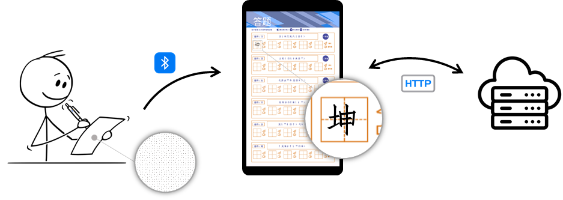

# BiPen

## 项目简介

本Android项目旨在提供一个蓝牙点读笔笔迹识别与展示的解决方案，其核心功能为蓝牙笔笔记实时响应。该项目实现一个高度复杂和多功能的系统，实现了蓝牙笔在纸面上的移动轨迹实时传输到Android平板设备中，并附带相应的蓝牙设备、答题纸、答题历史和用户管理逻辑。本项目集成了连接蓝牙笔、响应笔迹、虚拟按键触发、语音播报、答题历史查看和用户信息管理等功能。所有的数据都存储在后端进行管理和存储，以确保数据的安全性和可管理性，也便于对于数据进行更进一步的分析。

本项目按功能分为五个模块，分别是蓝牙笔模块、笔迹解析模块、语音播报模块、答题结果模块以及用户信息模块，更详细的内容介绍在后文中展示。需明确当前仅开发完成演示版本，仅限定一种类型固定大小的答题纸上，且打印参数固定。

 

## 功能模块简介

### 蓝牙笔模块

蓝牙笔模块为本项目的核心模块之一，涉及蓝牙笔连接、笔迹同步响应功能，需配合硬件公司提供的SDK以及蓝牙笔设备使用。本模块集成硬件厂商的SDK，并基于其功能进行扩充。

#### 基本原理

蓝牙笔中内置一个光电识别器，能够感应纸张中的码点信息，结合其他硬件记录下坐标等信息后，通过BLE蓝牙协议传输到Android设备，并配有相应的SDK进行解析。

识别效率受码点、纸张以及打印机的影响，为了实现稳定的笔迹传输，前期进行了大量的探索性工作，总结经验如下：

- 纸张选取：尽可能选择彩色激光纸（彩激纸），具有更高的色彩还原度和图像质量，相较于普通纸张会厚一些，当然成本高一些；当前以185*260铺码，选择常规的A4大小或者正16K皆可；
- 打印参数：打印时必须使用Adoba Acrobat系列软件，不能直接对带有码点的文件进行编辑，打印时确保能在软件中清楚的看到码点；分辨率调整为1200*1200，打印质量选择最佳，不同版本可能称呼不同；必须采取激光打印机，喷墨式打印机无效；必须进行彩色打印，黑白打印时黑色会遮挡码点影响识别，无法克服；
- 颜色设置：测试过五百多种颜色配置，最终结合视觉效果选择#4b4e9f和#d86f0b作为主要颜色；
- 码点大小：彩色打印可选择最小的2400-25尺寸码点，黑白打印600-6尺寸可以识别；

### 笔迹解析模块

该模块是本项目的另一核心模块，主要涉及答题纸坐标化、虚拟按键触发，这里将答题纸中绘制出的按钮称作虚拟按钮，通过判定点击坐标的位置进行虚拟按钮时间的响应。

本模块虚拟按键触发具有一定的创新，因此在此花很大篇幅介绍按钮触发的基本原理。

#### 基本原理

在纸张中进行常规书写时，产生的笔迹可以区分为书写笔迹和点击笔迹，分别对应着在田字格内的书写以及点击纸张中的按钮。点击事件所对应的笔迹通常位移较小，且在纸张中的固定位置，因此依据这两个判定条件即可对相应的点击事件进行触发。首先依据移动距离进行初版，再判定笔迹的中心点坐标是否在按钮判定框内，若成立则判定成功，触发虚拟按钮进行相应的事件。

答题纸的坐标化是虚拟按键触发的基础和关键一环。在这个模块中，将答题纸的物理坐标与数字化系统相连接，为后续的功能和操作提供了重要的基础。通过将答题纸的不同位置映射到数字坐标空间中，可以实现精确案件触发和交互功能。具体而言对于纸张中的每个田字格与按钮对象，将其中心位置的像素坐标作为该点坐标，并记录相应的编号、事件、半边距属性。通过PhotoShop工具进行人工标注记录可以完成这一任务。

在坐标化的基础上，可以将答题纸分为两类虚拟控件，即田字格和按钮。称之为虚拟控件的原因在于这类对象并不实际存在于Android设备中。两类对象共有的属性为id、中心坐标以及半边距，这里已假定田字格和按钮都是正方形，圆形可以转化为方形，而矩形则不再考虑范围内。

基于以上部分内容，分两阶段判定的点击事件可以分为如下步骤：

1. 点击判定：当检测到笔迹结束时，基于完整笔迹中点的移动距离，进行初步判定对应笔记是否为点击事件，若小于距离阈值则通过判定。移动距离判定通过连接所有笔迹点，计算相邻点的欧氏距离之和求得，公式如下：
   
   $$distance=\sum_{i=1}^{n-1} \sqrt{(x_{i+1} - x_i)^2 + (y_{i+1} - y_i)^2}$$
2. 点击再次判定：正常书写时包含的点和短移动的笔迹，同样会被触发为点击事件，需要进行第二步判定以精准识别点击操作所对应的按钮事件，并排除无关的点击事件。该步骤判定笔记的中心点坐标是否在虚拟按钮内部，如成立则通过判定，触发后续操作。具体而言，首先获取到笔迹的中心点坐标，在纸张中找到与其距离最近的虚拟控件，若最近距离的是一个虚拟按钮，且中心点到虚拟按钮的距离小于阈值距离，那么中心点对应的笔迹是一个点击虚拟按钮的操作。这里的阈值距离设定为虚拟按钮的半边距加上误差距离，保证在按钮框周围点击不会触发的现象。对于中心点到虚拟控件的距离计算，使用切比雪夫距离计算，该距离可以理解为判定点是否在方框内部，计算公式如下：
   
   $$D_{\text{Chebyshev}} = \max(|x_2 - x_1|, |y_2 - y_1|)$$
3. 点击事件触发
   
   在触发按钮事件的条件下，找到距离最近按钮，得到相应的位置、题号以及触发事件信息。当按钮事件对应“查答案”、“播放题目要求”、“停止/播放”按钮时直接触发对应的事件，而对应“提交”较为复杂，需绑定相同题号的方格，并获取方格内的笔迹进行提交。“提交”虚拟按钮与其他虚拟按钮的区别在于，该虚拟按钮需要获取到田字格内的笔迹进行提交，因此需要绑定相同id的田字格虚拟控件。虚拟田字格控件需要绑定在其内部的所有笔迹点，距离判定也依据切比雪夫距离。这样点击虚拟按钮后便会从绑定的田字格中获取到笔迹，进行提交操作。

 

### 其他模块

其他模块为系统附加功能，标准的开发逻辑就能解决并无新意。

语音模块实现语音播报功能，需将提前确定好的文字通过语音合成系统转化为语音，触发对应事件后进行语音播报。该项目使用在线语音合成工具[narakeet](https://www.narakeet.com/languages/chinese-text-to-speech-zh/)将文字转化为语音进行响应。

用户管理模块用于管理用户个人信息，主要有账号、密码、用户昵称、出生日期、性别五项信息，同时包括了登录、注册、退出登录、用户信息修改模块。该模块具体实现在下文中介绍

## 系统界面

## 开发与测试列表

铺码平台使用

铺码流程实现

铺码码点测试

铺码颜色测试

打印测试

底图设计

答题纸坐标化

SDK集成

Android蓝牙权限与引导开启

蓝牙笔连接

蓝牙笔迹复现

点击事件判定

点击事件响应

蓝牙笔连接UI

全局信息存储

页面布局

与后端通讯

语音事件集成

跳转优化

 

## 其他说明

开发时间紧张，出现了一些hard code的部分，后续开发可以修改。

本项目有一部分涉及到硬件厂商提供的代码，已隐去。
